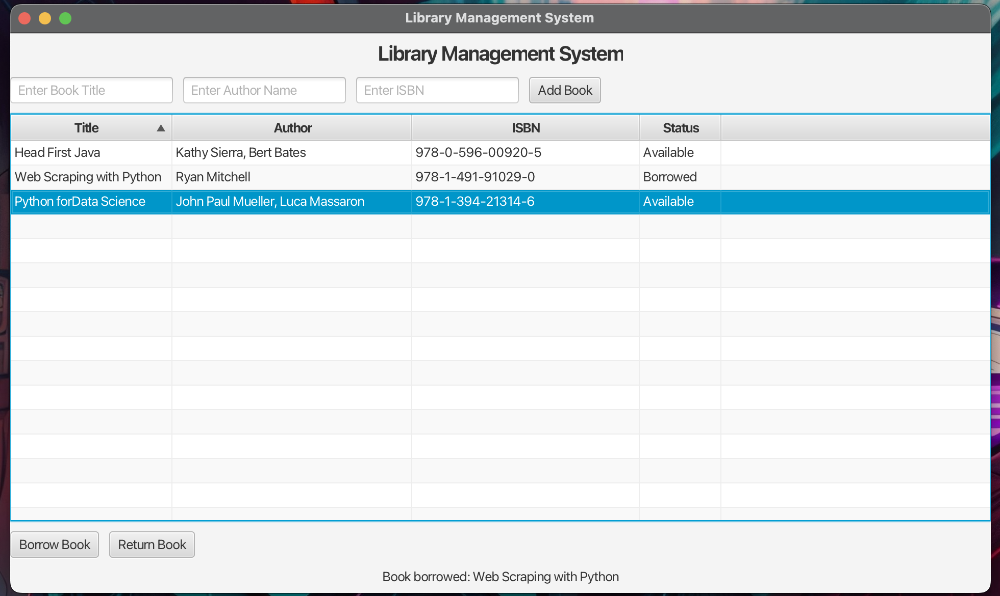

# Library Management System

This is my first Java and JavaFX project, built to learn the fundamentals of Java programming and GUI development with JavaFX. Currently, there is no database integration, but I plan to use SQLite in the future.

## Features

- **Add Books** – Allows users to add new books with title, author, and ISBN.
- **View Books** – Displays a list of books in the library.
- **Borrow & Return (Planned)** – The code can be extended to let users borrow and return books.

## Images



## Project Structure

```bash
.
├── src/
│   ├── application/
│   │   └── Main.java
│   ├── Controllers/
│   │   └── MainController.java
│   ├── Models/
│   │   └── Book.java
│   └── Views/
│       └── main-view.fxml
└── README.md
```

- **Main.java:** The entry point of the JavaFX application.
- **MainController.java:** Handles UI events (e.g., adding books).
- **Book.java:** A simple model class for storing book details.
- **main-view.fxml:** The FXML file defining the UI layout.

## Prerequisites

- Java 17+ (Java 21 recommended)
- JavaFX SDK (since JavaFX is no longer bundled with newer JDKs)

## How to Build and Run

1. Compile the Source Code

    ```bash
    javac --module-path /path/to/javafx-sdk-23.0.2/lib \
    --add-modules javafx.controls,javafx.fxml -d out src/**/*.java
    ```

2. Create the JAR File

    ```bash
    jar --create --file LibraryManagementSystem.jar -C out .
    ```

3. Run the Application

    ```bash
    java --module-path /path/to/javafx-sdk-23.0.2/lib \
    --add-modules javafx.controls,javafx.fxml -jar LibraryManagementSystem.jar
    ```

> **Note:** Adjust the path to your JavaFX SDK as needed.

## Future Plans

- **SQLite Integration:** Persist book data so it’s not lost on application exit.
- **Borrow/Return Feature:** Enhance the system to track which user has borrowed a book.
- **Docker Containerization:** Easily deploy the application in any environment.

## Contributing

Contributions are welcome! Please open an issue or submit a pull request if you have suggestions or improvements.

---
